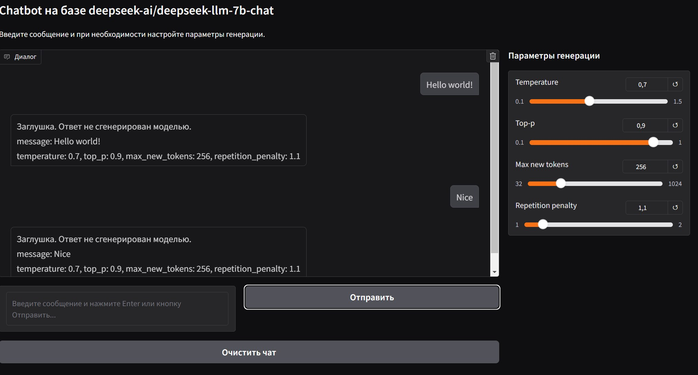

# Custom Chatbot Template

Небольшой  шаблон чат-бота на базе модели `deepseek-ai/deepseek-llm-7b-chat`, реализованный с использованием `transformers`, `Gradio` для пользовательского интерфейса и опциональной поддержки GPU через Docker.

  

**Внимание:** для ускорения разработки и тестирования интерфейс Gradio в текущей версии подключён к функции-заглушке `blank_response`, которая не использует модель. Это позволяет запускать приложение без загрузки весов модели.  
Чтобы подключить настоящую модель и полнофункциональный чат, необходимо раскомментировать импорт и использование метода `get_chat_response` из модуля `chat_service` в файле `app/ui/interface.py`, а также заменить вызов `blank_response` на `get_chat_response` внутри функции `respond`.

## Содержание

- [Custom Chatbot Template](#custom-chatbot-template)
  - [Содержание](#содержание)
  - [Функции](#функции)
  - [Установка](#установка)
    - [Локально (без Docker)](#локально-без-docker)
  - [Структура проекта](#структура-проекта)
  - [Запуск](#запуск)
    - [С публичной ссылкой (через Gradio)](#с-публичной-ссылкой-через-gradio)
  - [Docker](#docker)
    - [Сборка и запуск (GPU)](#сборка-и-запуск-gpu)
    - [CPU-версия](#cpu-версия)
  - [Замена модели](#замена-модели)
  - [Параметры `settings`](#параметры-settings)
  - [Лицензия](#лицензия)

## Функции

- Использование модели `DeepSeek` из Hugging Face
- Чат-интерфейс через Gradio
- Поддержка параметров генерации (`temperature`, `top_p`, `max_tokens`, и др.)
- Хранение истории чата
- Гибкая архитектура (модули: модель, сервисы, UI)
- Поддержка Docker (CPU и GPU)

## Установка

### Локально (без Docker)

1. Установите зависимости:

```bash
python -m venv venv
source venv/bin/activate
pip install --upgrade pip
pip install -r requirements.txt
```

2. Запустите сервис:

```bash
python app/main.py
```

## Структура проекта

```
.
├── app/
│   ├── config.py              # Конфигурация
│   ├── main.py                # Точка входа
│   ├── models/                # Загрузка модели
│   ├── services/              # Логика чата и история
│   ├── ui/                    # Интерфейс Gradio
│   └── utils/                 # Логирование
│
├── docker/                   # Docker-файлы и .env
├── tests/                    # Тесты
├── requirements.txt
├── Dockerfile                # GPU-версия
├── NonGPUDockerfile            # CPU-версия
└── README.md
```

## Запуск

### С публичной ссылкой (через Gradio)

```bash
python app/main.py
```

После запуска приложения интерфейс будет доступен в браузере по адресу:  
- [http://127.0.0.1:7860](http://127.0.0.1:7860)

Чтобы получить ссылку для общего доступа, используйте:

```python
launch_ui(share=True)
```

Или можно изменить в конфиге.

## Docker

### Сборка и запуск (GPU)

Убедитесь, что установлен `nvidia-container-toolkit` и драйвера.

```bash
cd docker
docker-compose up --build
```

### CPU-версия

```bash
cd docker
docker-compose docker-compose.slim.yml up --build
```

## Замена модели

Чтобы использовать другую языковую модель из Hugging Face, достаточно изменить значение переменной `MODEL_NAME`.

1. Открой файл `app/config.py` или `.env`
2. Укажи имя другой модели, например:

```
MODEL_NAME=tiiuae/falcon-7b-instruct
```

3. Убедись, что новая модель поддерживает режим генерации (`CausalLM`) и совместима с используемыми параметрами (`temperature`, `top_p` и т. д.)
4. При необходимости очисти кэш модели, удалив содержимое директории `data/cached_dir`

После этого модель будет загружена автоматически при следующем запуске приложения.

Если ты используешь Docker, не забудь пересобрать образ:

```bash
docker-compose build
```

## Параметры `settings`

| Параметр            | Тип        | Описание                                                                 |
|---------------------|------------|--------------------------------------------------------------------------|
| `MODEL_NAME`        | `str`      | Название модели на Hugging Face. Пример: `deepseek-ai/deepseek-llm-7b-chat` |
| `CACHE_DIR`         | `Path`     | Локальная директория для кэширования модели. По умолчанию: `data/cached_dir` |
| `DEVICE`            | `str`      | Устройство для запуска модели: `"cuda"` или `"cpu"`. Определяется автоматически |
| `LOG_DIR`           | `Path`     | Директория для логов. По умолчанию: `logs/`                                |
| `LOG_LEVEL`         | `str`      | Уровень логирования (`DEBUG`, `INFO`, `WARNING`, `ERROR`)                |
| `env_file` (внутри `Config`) | `str` | Путь к `.env` файлу. По умолчанию: `docker/.env`                          |

## Лицензия

Проект распространяется под лицензией Apache License 2.0.  
Полный текст лицензии доступен в файле [LICENSE](LICENSE).